# Migration Validation — React Native → SwiftUI, verified with Revyl

This document is the proof-of-migration for the SwiftUI port of
[RevylAI/bug-bazaar](https://github.com/RevylAI/bug-bazaar). Every screenshot below was
captured on a **Revyl cloud iOS device** driving **both apps in the same device session** —
the original Expo/React Native build and this Swift port share the bundle id
`com.bugbazaar.app`, so installing one replaces the other and the same test flow can be
replayed against each.

The interesting part isn't just that the port looks the same. Bug Bazaar is a bug-hunting
fixture: it ships two **intentional** defects that Revyl demos are built around. A faithful
migration has to reproduce the bugs too — and the side-by-sides below show it does,
down to the dollar.

## The workflow

Everything ran through the Revyl CLI. No local simulator was needed after the initial
smoke test:

```bash
# 1. Build on a Revyl cloud runner straight from the working tree (~1 min)
revyl build --remote --platform ios

# 2. Provision a cloud device with the freshly built app
revyl device start --platform ios --app-id dcc3ba2f-d31e-4953-9d31-f1675120c130

# 3. Drive it with AI-grounded actions — no coordinates, no selectors
revyl device tap --target "plus button below the Orchid Mantis product card"
revyl device instruction "type Goliath into the focused search field"
revyl device navigate --url "bug-bazaar://revyl-auth?token=revyl-demo-token&role=collector&redirect=%2Fcheckout"
revyl device screenshot --out swift-shop.png

# 4. Swap in the original React Native build on the SAME session and replay
revyl device install --app-id c7d75abb-49f5-4391-beb6-0ffd1a6b668d
revyl device launch com.bugbazaar.app
```

The `--target` taps are grounded by Revyl's vision models against a plain-English
description, so the *identical commands* work on both the React Native UI and the SwiftUI
UI — the flows are described by intent, not implementation. That's what makes
cross-framework comparison practical: the test script doesn't care which framework
rendered the button.

## Side by side: original (left) vs SwiftUI port (right)

### Shop

| React Native | SwiftUI |
| --- | --- |
| 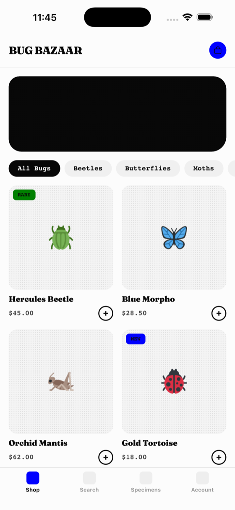 | 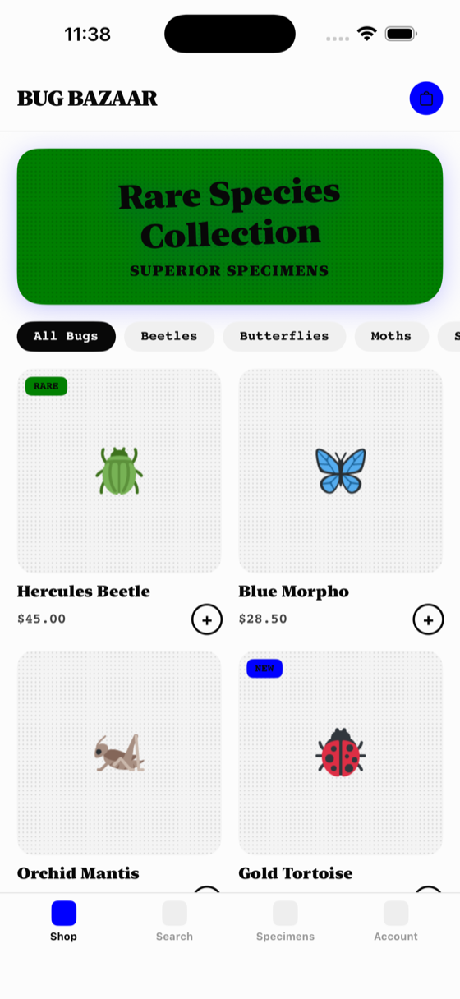 |

Same layout, cards, badges, prices, filter chips, and custom tab bar. One delta is visible
and it's in the *original*: the uploaded RN build predates the current hero-banner source,
so its hero renders as a black box, while the port implements the green halftone sticker
card from today's `HeroBanner.tsx`.

### Intentional bug #1 — the Orchid Mantis switcheroo

Adding **Orchid Mantis** (id 3, $62.00) silently puts **Gold Tortoise** (id 4, $18.00) in
the cart. Both builds, same wrong bug, same right math ($18.00 + $5.99 shipping + $1.44 tax
= $25.43):

| React Native | SwiftUI |
| --- | --- |
| 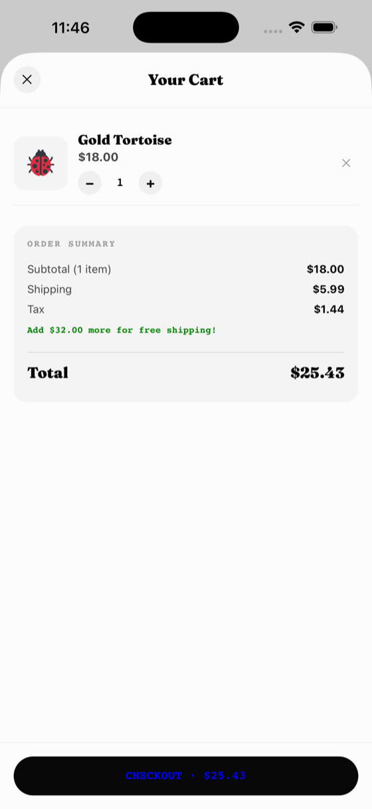 | 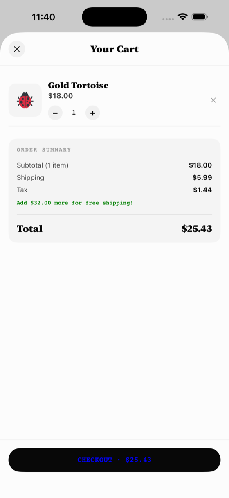 |

Port source: `BugBazaar/Stores/CartStore.swift` (`// BUG:` comment), mirroring
`context/CartContext.tsx` in the original.

### Intentional bug #2 — Goliath Beetle drops the tax

With **Goliath Beetle** (id 8) in the cart, the checkout review card totals correctly
(**$77.76**, tax included, free shipping over $50) — but the Place Order button charges
**$72.00**, excluding tax. Identical on both builds:

| React Native | SwiftUI |
| --- | --- |
| 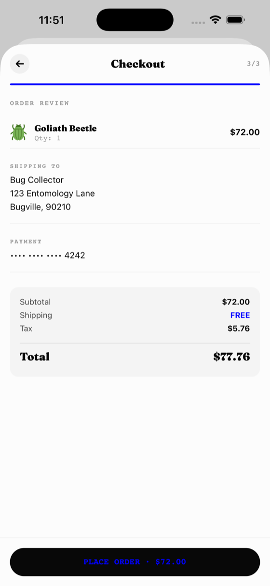 | 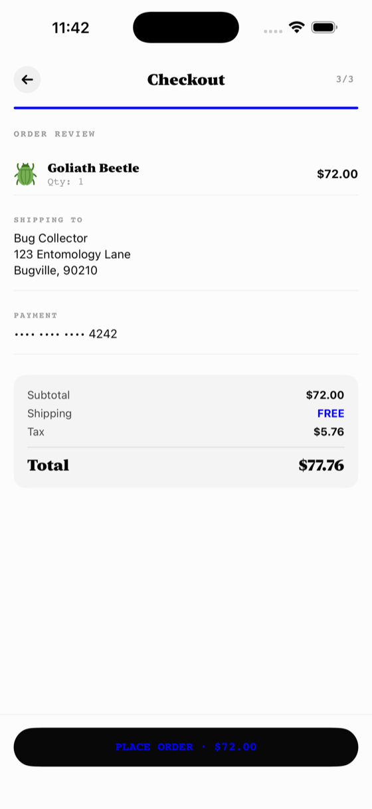 |

And the cart that led there, for completeness:

| React Native | SwiftUI |
| --- | --- |
| 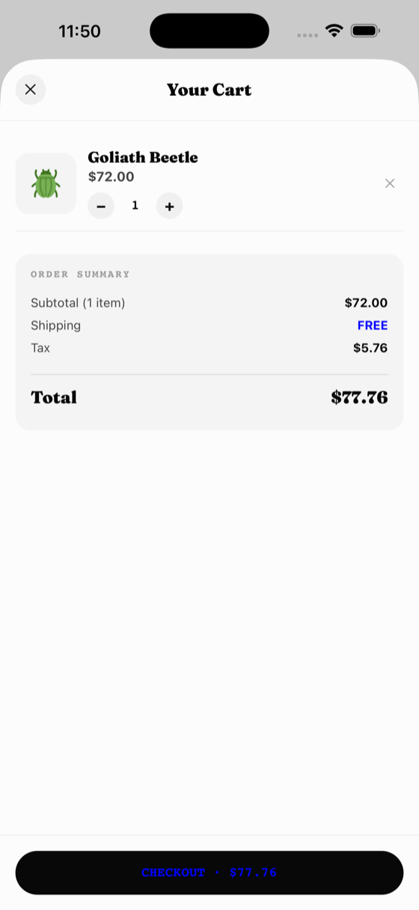 | 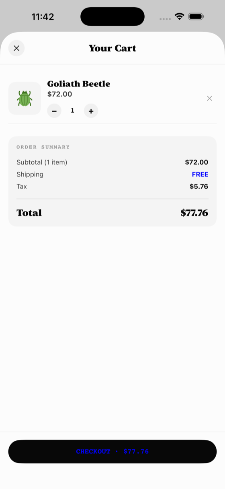 |

Port source: `BugBazaar/Screens/CheckoutView.swift`, mirroring `app/checkout/index.tsx`.

### Revyl auth-bypass deep link

Bug Bazaar is the reference app for Revyl's auth-bypass deep-link pattern. The port keeps
the full contract — token check against launch vars (with demo fallback), role allowlist,
redirect allowlist, and visible accepted/rejected states on the Account tab.

`revyl device navigate --url "bug-bazaar://revyl-auth?token=revyl-demo-token&role=collector&redirect=%2Fcheckout"`
lands directly on checkout, signed in:

| Routed to /checkout | Account: accepted | Account: wrong token rejected |
| --- | --- | --- |
| 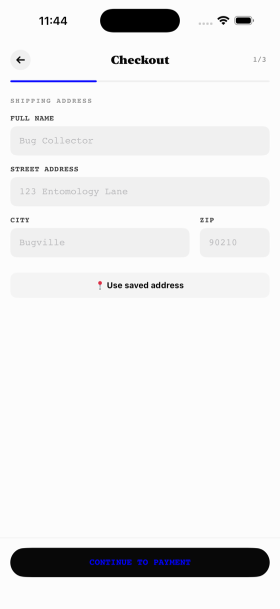 | 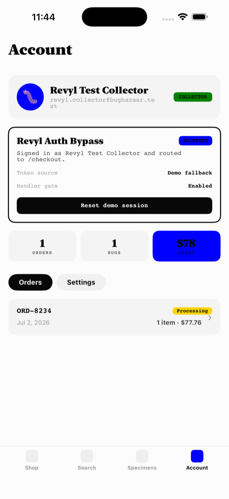 | 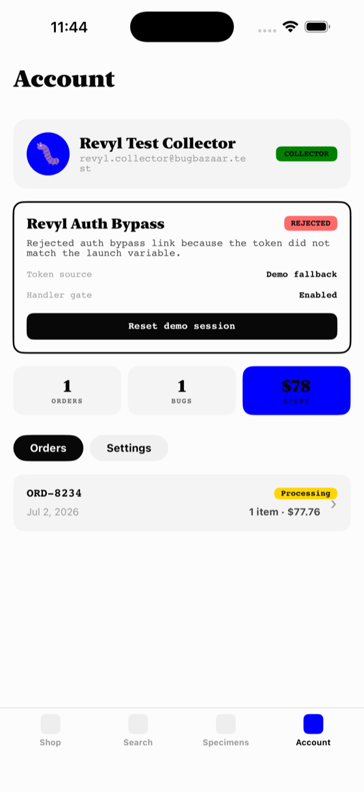 |

The rejected link (`token=wrong-token`) follows the original's Expo Router backstop
behavior: route to the Account tab and keep the failure reason visible.

### End-to-end checkout

The full flow — search, add, three-step checkout with saved-address / demo-card autofill,
processing state, confirmation, order history with status badge and stats:

| Search | Order placed |
| --- | --- |
| 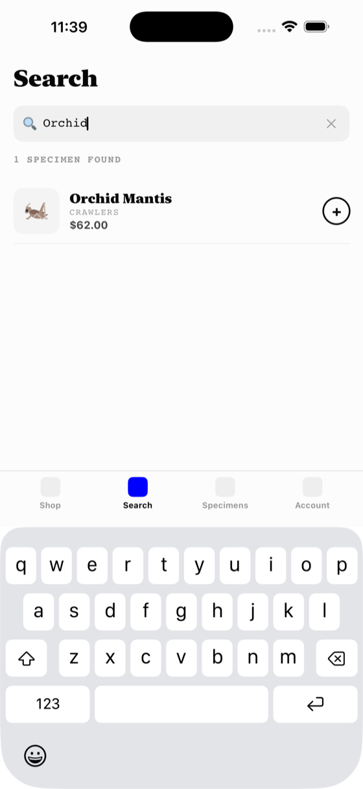 | 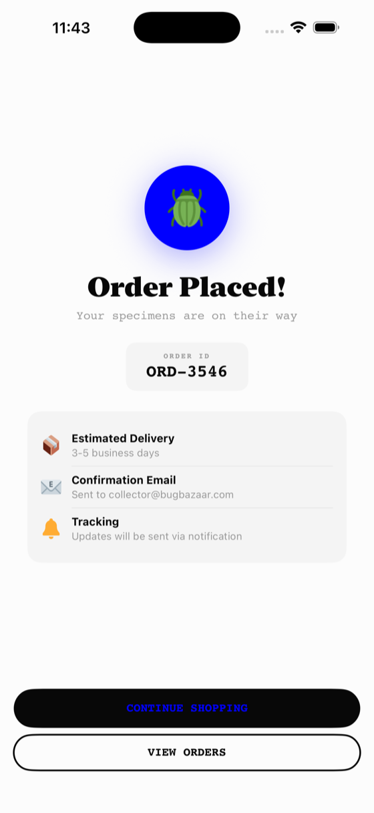 |

## Behavior parity matrix

| Check | React Native | SwiftUI | Match |
| --- | --- | --- | :-: |
| Cart math ($45 item): subtotal/shipping/tax | $45.00 / $5.99 / $3.60 → $54.59 | same | ✅ |
| Free-shipping nudge under $50 | "Add $5.00 more…" | same | ✅ |
| Bug #1: add Orchid Mantis → Gold Tortoise | $18.00 in cart, total $25.43 | same | ✅ |
| Free shipping over $50 (Goliath) | FREE, total $77.76 | same | ✅ |
| Bug #2: Place Order button with Goliath | $72.00 (tax dropped) | same | ✅ |
| Order stored with correct total | $77.76 | same | ✅ |
| Deep link: valid token/role/redirect | signs in, routes to /checkout | same | ✅ |
| Deep link: wrong token | REJECTED state on Account tab | same | ✅ |

## Notes for anyone reproducing this

- The Xcode project is committed, so the Revyl remote runner needs nothing but
  `xcodebuild` — see `.revyl/config.yaml`. The remote iOS build takes about a minute.
- Screenshots in `docs/validation/` are downscaled copies of the raw device captures.
- Known intentional substitutions in the port: system New York serif (black) in place of
  Fraunces 900, and native SwiftUI navigation (`NavigationStack` + sheet) in place of
  Expo Router's stack/modal. Colors are exact, including the original theme's
  `stickerGreen: 'blue'` / `mangoOrange: 'green'` CSS named colors.
